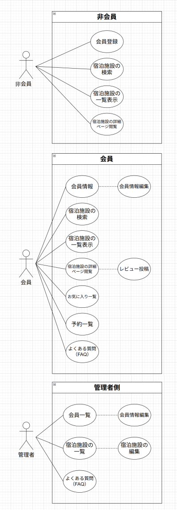
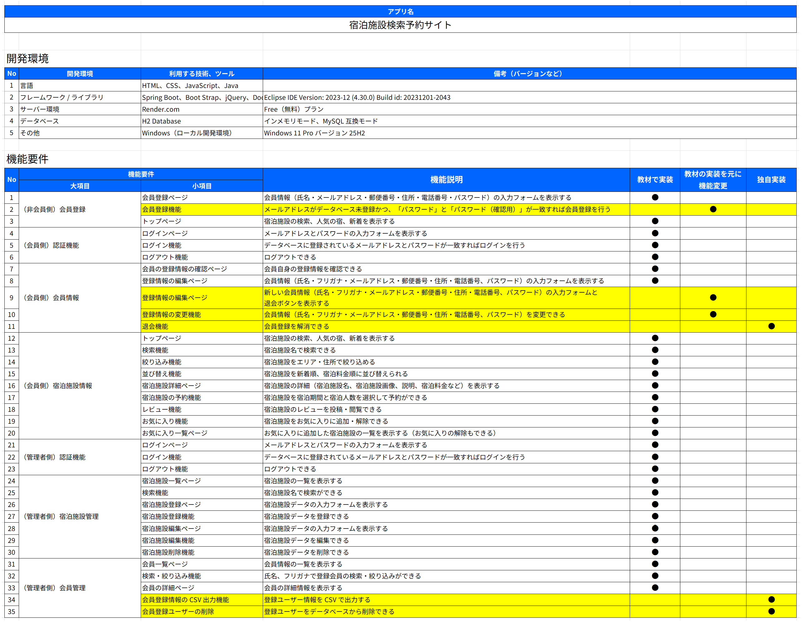
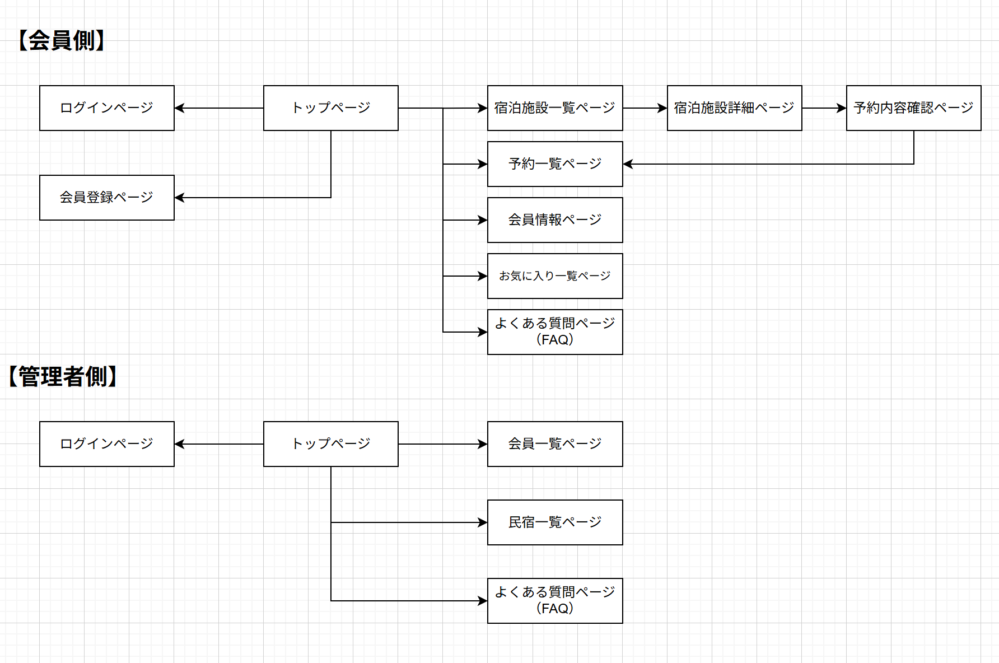
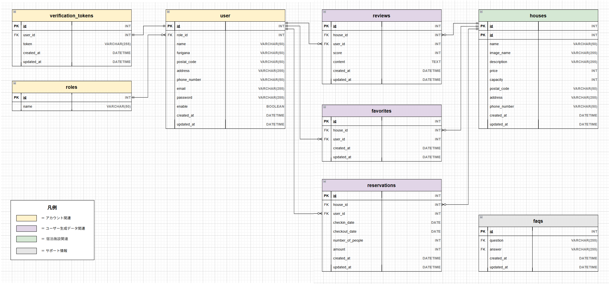
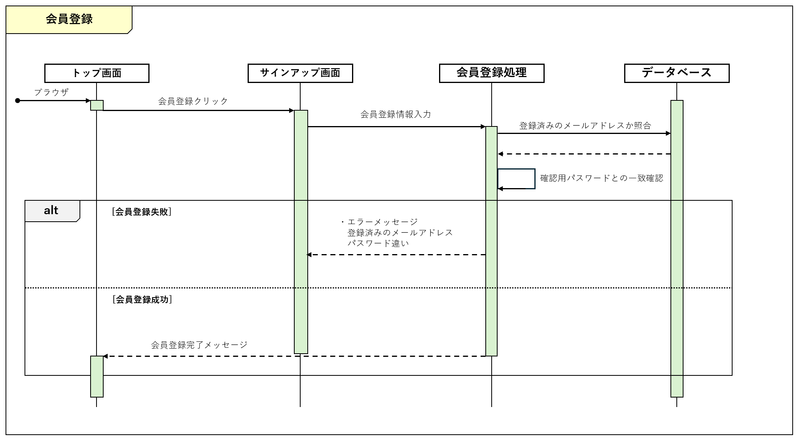

# 宿泊施設検索予約サイト
###### ※本リポジトリは公開用のクローンリポジトリ
### 成果物（Render.com にて公開）
[宿泊施設検索予約サイト](https://accommodation-search-and-booking-system-cuz8.onrender.com)
#### Render.com 無料プランによるサイトの制限
・15分間サイトにアクセスが無い場合（サイト内で操作が無い場合も）スリープする 
・スリープからサイトが立ち上がるのに２～３分くらいかかる 
・スリープするとサイト内の変更（ユーザー登録、レビューの投稿、施設やユーザーの削除など）は次にサイトが立ち上がる時に初期化（リセット）される

## 構成図

## 用語の定義
|用語|意味|
|---|---|
|会員|サイト登録済みユーザー|
|非会員|サイト非登録ユーザー|
|管理者|サイトを管理するユーザー|

## ユースケース図

## 機能要件

## 画面遷移図

## ER 図

## シーケンス図
### 会員登録

